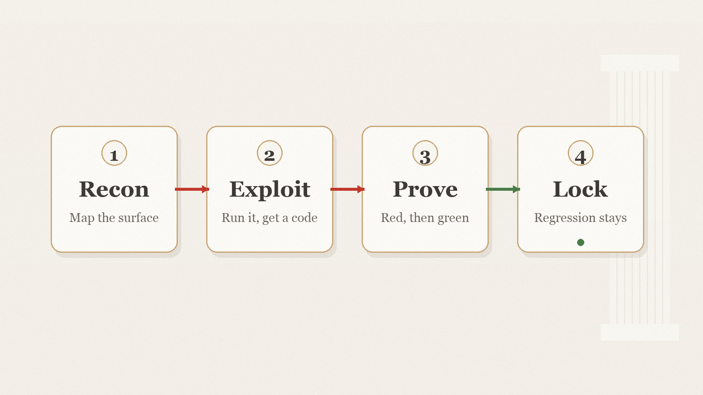

# Arez

A red team that proves the hole by running it and locks it with a red-to-green regression, not a report.

[Русский](README.ru.md) · [中文](README.zh.md)

[](LICENSE) [](https://github.com/zarubinvibe/arez/stargazers) [](https://github.com/zarubinvibe/arez) [](https://github.com/zarubinvibe/athena#olympuz-family)

<p align="center"></p>

<!-- owner-welcome:start -->

> Hello. I am a lawyer with two daughters and a coffee business, and I vibe-code my own tools at night. My agents run security passes on my code, and the honest ones kept slipping. A scanner would report a hole, I would trust it, and there was nothing there. Or a green test sat on top of a hole that never moved.
>
> So Arez counts a finding only when it was executed. A test goes red on the broken code and green after the fix, watched by a separate process, and the regression stays in the gate for good. It hits a live target only on your own machine, on 127.0.0.1, under its own sandbox. If you want a red team that proves instead of guesses, take it and make it yours.
>
> — Filipp Zarubin

<!-- owner-welcome:end -->

## Contents

- [What This Is](#what-this-is)
- [Why It Helps](#why-it-helps)
- [The Main Advantage](#the-main-advantage)
- [How It Works](#how-it-works)
- [Quickstart](#quickstart)
- [Simple Comparison](#simple-comparison)
- [Simple Words](#simple-words)
- [Safety And Privacy](#safety-and-privacy)
- [Limits](#limits)
- [Star And Contribute](#star-and-contribute)

<!-- beginner-readme:start -->

## What This Is

Arez is Ares, the red-team god of the Olympuz family, cut out as a standalone tool. It runs a real security campaign against a target. It maps the surface, runs the exploit, and counts a finding only after a test was watched going red on the broken code and green after the fix.

The regression then lives in your own gate for good. It is the full native Deimos, phases A through D, with zero external dependencies. It hits a live target only on 127.0.0.1, under its own sandbox, and never reaches off your machine.

## Why It Helps

Most security agents hand back a report: a list of things that look insecure. Half of them are not real, and the real ones get lost in the noise. Worse, a green test can sit on top of a hole that never moved, and nobody notices.

Arez refuses that. A finding is real only when the exploit was executed and the fix was watched closing it. If you pay an agent to check your code, you want the flags to be real, and the proof to be a test you can run yourself.

## The Main Advantage

**Main advantage:** a finding counts only after the exploit was run and the fix was watched turning the test from red to green, and that proof stays as a test you can run yourself.

**Why this is better:** A scanner hands you a report and moves on. Arez cannot. It never writes "theoretically an attacker could": a claim that will not run is refused. It never trusts a green test that was green before the fix. It never calls its own patch clean; the verdict is the gate's exit code, run by a separate process the attacking agent cannot reach. When a hole needs real egress to prove, it is logged as held, not passed off as a win.

## How It Works

A campaign moves through four stages. Each hands the next something it can check. Nothing becomes a finding until it has been executed and proven.

<!-- workflow-diagram:start -->

<p align="center"></p>

<!-- workflow-diagram:end -->

| Stage | What happens |
|---|---|
| 1. Recon | The attack surface gets mapped before any exploit runs |
| 2. Exploit | The exploit is run against the target for an exit code |
| 3. Prove | A coordinator watches the test go red, then green |
| 4. Lock | The regression stays in the gate for good |

### Step 1: Map the surface

The first stage reads the target. It finds which endpoints answer, where input enters, and what the agent may touch. Nothing is attacked yet. A surface no scanner flagged is dropped honestly, not turned into a claim.

**You get:** a map of trust boundaries and input points, ready for the exploit stage.

### Step 2: Run the exploit

Ares runs the real exploit against the target. It runs on 127.0.0.1, under its own sandbox. What comes back is an exit code, not a paragraph. A claim of "theoretically an attacker could" is refused. An exploit that will not run is not a finding.

**You get:** an executed exploit with a real exit code, or an honest drop.

### Step 3: Watch red to green

The proof is not the agent's word. A separate coordinator runs the exploit test on the unfixed tree and sees it fail. Then it runs on the fixed tree and sees it pass. Red before, green after: that is proof. A test already green before the fix is hollow, and thrown out.

**You get:** an observed red-to-green, judged by exit code out of the agent's reach.

### Step 4: Lock the regression

The test that proved the hole becomes a permanent regression. Every later run goes red the moment the flaw returns. The posture ratchets tighter over time. It is not rescanned from scratch. This is what separates Arez from a scanner that hands back a report and forgets.

**You get:** a permanent test, red on the flaw forever, living in your own gate.

## Quickstart

You need a Mac or Linux, Node.js 22 or newer, and git. For the live hunt you also want an agent in the terminal: `claude` or `codex`. Three doors from here, any of them works.

```bash
git clone https://github.com/zarubinvibe/arez.git ~/arez
cd ~/arez

# Plain terminal, no agent needed: install checks your machine, then the gate proves the tool
bash install.sh
node bin/arez.ts gate

# In an editor: open the folder in Claude Code or VS Code
code .

# Drive a live campaign with an agent in the terminal
claude   # or: codex
```

No Git? Download [the ZIP](https://github.com/zarubinvibe/arez/archive/refs/heads/main.zip), unpack it, and run the same `./install.sh` inside. Prefer an archive in the terminal? Take [the tarball](https://github.com/zarubinvibe/arez/archive/refs/heads/main.tar.gz). First time here? Open the project in Claude Code and run `/arez-setup`: the install goes as a conversation, one question at a time, and nothing runs without your yes.

Never done this before? [The onboarding](docs/ONBOARDING.md) walks the whole first run step by step and says what you see after every command.

**You get:** the installer greets you, checks what you already have, runs its own gate, and names honestly what will not work on your system.

## Simple Comparison

| Option | Effort | Does it prove? | Undoable / locked | Coverage | The catch |
|---|---|---|---|---|---|
| **Arez** | Install once, read one gate | Yes: red-to-green, watched | Locked as a regression forever | One target, deep | Needs macOS for the live sandbox |
| A scanner that returns SARIF | One quick scan | No: a self-claim | Nothing is locked | Broad but shallow | Half the report is not real |
| Asking the model "is this safe?" | One fast question | No: a guess | Nothing is locked | Any code | A green test on a real hole passes it too |
| A red team of parallel skeptics | Many agents at once | No: opinions, not runs | Nothing is locked | Wide on paper | Fan-out multiplies the blast radius |
| Reviewing the code by hand | Slow, careful | Only if you write the test | Only if you keep the test | Whatever you reach | Hours per pass, and humans tire |
| Buying a bigger-context model | No setup at all | No: still a guess | Nothing is locked | Everything fits a while | You pay for every byte again each turn |

Names belong to their owners. The table describes purpose, not a benchmark: other tools change, and this page makes no promises for them.

## Simple Words

| Word | Simple meaning |
|---|---|
| Repository | The project folder that Git stores and versions |
| Terminal | The window where you type commands |
| Command | One instruction you give the computer |
| Branch | A separate line of changes that does not touch `main` |
| Pull Request | A request to review your change and accept it |
| observed-RED | A finding is real only when a separate coordinator watched the test fail on the broken code and pass after the fix. Not the agent's word, an exit code it saw itself. |
| hollow test | A test that is green both before and after the fix. It reproduces nothing, so Arez throws it out instead of calling it proof. |
| seatbelt | The sandbox the target runs under. It hits 127.0.0.1 only, cannot reach off your machine, and a canary proves the containment is real. |

## Safety And Privacy

- A
- r
- e
- z
-  
- i
- s
-  
- a
- n
-  
- o
- f
- f
- e
- n
- s
- i
- v
- e
-  
- t
- o
- o
- l
-  
- b
- u
- i
- l
- t
-  
- t
- o
-  
- b
- e
-  
- h
- o
- n
- e
- s
- t
-  
- a
- b
- o
- u
- t
-  
- i
- t
- s
-  
- l
- i
- m
- i
- t
- s
- .
-  
- I
- t
-  
- h
- i
- t
- s
-  
- a
-  
- l
- i
- v
- e
-  
- t
- a
- r
- g
- e
- t
-  
- o
- n
- l
- y
-  
- o
- n
-  
- 1
- 2
- 7
- .
- 0
- .
- 0
- .
- 1
- ,
-  
- u
- n
- d
- e
- r
-  
- i
- t
- s
-  
- o
- w
- n
-  
- O
- S
- -
- l
- e
- v
- e
- l
-  
- s
- a
- n
- d
- b
- o
- x
- ,
-  
- w
- i
- t
- h
-  
- z
- e
- r
- o
-  
- h
- o
- s
- t
-  
- e
- g
- r
- e
- s
- s
- .
-  
- I
- t
-  
- s
- p
- a
- w
- n
- s
-  
- n
- o
-  
- s
- u
- b
- -
- a
- g
- e
- n
- t
- s
- :
-  
- i
- t
-  
- i
- s
-  
- a
-  
- l
- e
- a
- f
- ,
-  
- o
- n
-  
- p
- u
- r
- p
- o
- s
- e
- ,
-  
- b
- e
- c
- a
- u
- s
- e
-  
- f
- a
- n
- -
- o
- u
- t
-  
- m
- u
- l
- t
- i
- p
- l
- i
- e
- s
-  
- t
- h
- e
-  
- b
- l
- a
- s
- t
-  
- r
- a
- d
- i
- u
- s
- .
-  
- I
- t
-  
- n
- e
- v
- e
- r
-  
- r
- u
- n
- s
-  
- D
- o
- c
- k
- e
- r
- ,
-  
- r
- a
- w
-  
- s
- o
- c
- k
- e
- t
- s
- ,
-  
- o
- r
-  
- s
- o
- m
- e
- o
- n
- e
-  
- e
- l
- s
- e
- '
- s
-  
- k
- e
- y
- .
-  
- A
-  
- s
- t
- e
- p
-  
- t
- h
- a
- t
-  
- n
- e
- e
- d
- s
-  
- a
-  
- n
- e
- t
- w
- o
- r
- k
-  
- o
- r
-  
- s
- h
- e
- l
- l
-  
- g
- r
- a
- n
- t
-  
- c
- a
- r
- r
- i
- e
- s
-  
- a
-  
- o
- n
- e
- -
- t
- i
- m
- e
-  
- h
- u
- m
- a
- n
-  
- g
- a
- t
- e
- .

The gate runs the tests in a separate process the attacking agent cannot reach, so the tool never judges its own patch. A hole that needs real egress off the machine is logged as held and unprovable, never dressed up as a win.

## Limits

Working: the full native Deimos A to D, the anti-theater core, the vendored-core doctor, and the end-to-end acceptance scenario all pass the gate. Ahead: the live seat-adapter when the Olympuz swarm is assembled, and a portable sandbox so the live target runs beyond macOS.

- O
- n
- e
-  
- c
- a
- m
- p
- a
- i
- g
- n
-  
- f
- i
- n
- d
- s
-  
- a
- b
- o
- u
- t
-  
- h
- a
- l
- f
-  
- o
- f
-  
- w
- h
- a
- t
-  
- i
- s
-  
- t
- h
- e
- r
- e
- .
-  
- A
- r
- e
- z
-  
- d
- o
- e
- s
-  
- n
- o
- t
-  
- m
- i
- s
- t
- a
- k
- e
-  
- a
-  
- r
- u
- n
-  
- f
- o
- r
-  
- a
-  
- f
- u
- l
- l
-  
- a
- u
- d
- i
- t
- .
-  
- I
- t
-  
- n
- e
- e
- d
- s
-  
- m
- a
- c
- O
- S
-  
- f
- o
- r
-  
- t
- h
- e
-  
- l
- i
- v
- e
- -
- t
- a
- r
- g
- e
- t
-  
- s
- a
- n
- d
- b
- o
- x
-  
- t
- o
- d
- a
- y
- ;
-  
- t
- h
- e
-  
- g
- a
- t
- e
-  
- a
- n
- d
-  
- d
- o
- c
- t
- o
- r
-  
- r
- u
- n
-  
- e
- v
- e
- r
- y
- w
- h
- e
- r
- e
- .
-  
- T
- h
- e
-  
- l
- i
- v
- e
-  
- h
- u
- n
- t
-  
- n
- e
- e
- d
- s
-  
- a
- n
-  
- a
- g
- e
- n
- t
-  
- C
- L
- I
- ,
-  
- C
- l
- a
- u
- d
- e
-  
- o
- r
-  
- C
- o
- d
- e
- x
- ;
-  
- w
- i
- t
- h
- o
- u
- t
-  
- o
- n
- e
- ,
-  
- t
- h
- e
-  
- g
- a
- t
- e
-  
- a
- n
- d
-  
- d
- o
- c
- t
- o
- r
-  
- s
- t
- i
- l
- l
-  
- w
- o
- r
- k
- .
-  
- s
- t
- r
- i
- x
-  
- i
- s
-  
- a
-  
- l
- o
- c
- a
- l
-  
- r
- e
- f
- e
- r
- e
- n
- c
- e
-  
- b
- e
- n
- c
- h
-  
- o
- n
- l
- y
- ,
-  
- n
- e
- v
- e
- r
-  
- a
-  
- d
- e
- p
- e
- n
- d
- e
- n
- c
- y
- .

`docs/MASTER-PLAN.md` sequences the Deimos phases A to D by dependency. `docs/ONBOARDING.md` walks a first install step by step. `AGENTS.md` holds the doctrine and the invariants. `SECURITY.md` holds the safety model. `tests/CORPUS.md` names every probe.

## Star And Contribute

Useful? Give Arez a star: [https://github.com/zarubinvibe/arez](https://github.com/zarubinvibe/arez). It takes a second and it decides whether other people ever find the project.

Want to change something? The path is short: fork the repository, create a branch, commit your change, push the branch, then open a Pull Request. Do not push directly to `main`; the release gate rejects it.

Found a problem instead? Open an issue at [https://github.com/zarubinvibe/arez/issues](https://github.com/zarubinvibe/arez/issues) and say what you ran and what happened.

<!-- beginner-readme:end -->

<!-- pantheon-family:start -->
## Olympuz family

This is one of the public [Olympuz projects](https://github.com/zarubinvibe/athena#olympuz-family). Each row opens the repository or downloads its source as a ZIP.

| Type | Name | What it does | Source |
|---|---|---|---|
| project | Athena | Portable agent OS that restores a complete Claude and Codex setup on a new Mac. | [Repository](https://github.com/zarubinvibe/athena) · [ZIP](https://github.com/zarubinvibe/athena/archive/refs/heads/main.zip) |
| project | Helioz | 24/7 agent work conveyor with verified completion markers and goal-based overnight decisions. | [Repository](https://github.com/zarubinvibe/helioz) · [ZIP](https://github.com/zarubinvibe/helioz/archive/refs/heads/main.zip) |
| project | Mnemazine | Local-first memory system that turns raw inputs into verified reusable knowledge. | [Repository](https://github.com/zarubinvibe/mnemazine) · [ZIP](https://github.com/zarubinvibe/mnemazine/archive/refs/heads/main.zip) |
| project | Themiz | Multi-agent assistant for Russian litigation with local OCR and review by a five-jurist council. | [Repository](https://github.com/zarubinvibe/themiz) · [ZIP](https://github.com/zarubinvibe/themiz/archive/refs/heads/main.zip) |
| project | Zeuz | Factory that turns an idea into a governed multi-agent workflow with gates, observability, and replay. | [Repository](https://github.com/zarubinvibe/zeuz) · [ZIP](https://github.com/zarubinvibe/zeuz/archive/refs/heads/main.zip) |
| project | Lynceuz | Collects public web evidence at zero cost and stops with an honest reason when the safe routes end. | [Repository](https://github.com/zarubinvibe/lynceuz) · [ZIP](https://github.com/zarubinvibe/lynceuz/archive/refs/heads/main.zip) |
<!-- pantheon-family:end -->

## License

Apache-2.0, because Arez carries the vendored Olympuz core.
