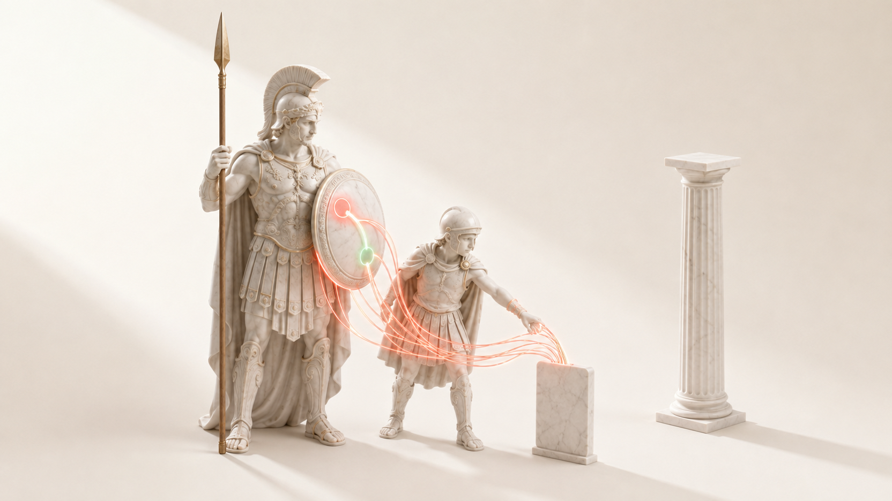
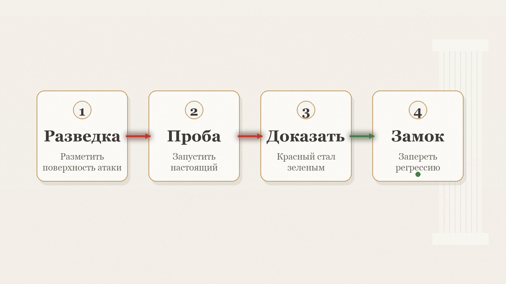

# Arez

Красная команда, которая доказывает дыру запуском и запирает ее регрессией red-to-green, а не отчетом.

[English](README.md) · [中文](README.zh.md)

[](LICENSE) [](https://github.com/zarubinvibe/arez/stargazers) [](https://github.com/zarubinvibe/arez) [](https://github.com/zarubinvibe/athena#olympuz-family)

<p align="center"></p>

<!-- owner-welcome:start -->

> Привет. Я юрист, у меня две дочки и кофейное дело, а по вечерам я вайб-кожу свои инструменты. Мои агенты гоняют security-проходы по коду, и честные из них все время подводили. Сканер репортит дыру, я ему верю, а там пусто. Или зеленый тест сидит поверх дыры, которая никуда не делась.
>
> Поэтому Arez засчитывает находку только когда ее выполнили. Тест краснеет на дырявом коде и зеленеет после фикса, за этим следит отдельный процесс, а регрессия остается в гейте навсегда. Живую цель он бьет только на твоей машине, на 127.0.0.1, под своей песочницей. Нужна красная команда, которая доказывает, а не гадает, забирай и делай своей.
>
> — Филипп Зарубин

<!-- owner-welcome:end -->

## Оглавление

- [Что это](#что-это)
- [Зачем это нужно](#зачем-это-нужно)
- [Главное преимущество](#главное-преимущество)
- [Как это работает](#как-это-работает)
- [Быстрый старт](#быстрый-старт)
- [Простое сравнение](#простое-сравнение)
- [Простые слова](#простые-слова)
- [Безопасность и приватность](#безопасность-и-приватность)
- [Ограничения](#ограничения)
- [Звезда и вклад](#звезда-и-вклад)

<!-- beginner-readme:start -->

## Что это

Arez это Арес, бог красной команды семьи Olympuz, вырезанный в отдельный инструмент. Он ведет настоящую security-кампанию против цели. Он размечает поверхность, запускает эксплойт и засчитывает находку только когда тест на глазах покраснел на дырявом коде и позеленел после фикса.

Эта регрессия потом живет в твоем гейте навсегда. Арес воюет с твоим кодом, чтобы найти его изъяны и починить их. Он воюет не один. Деймоз, его сын, ужас, что въезжал с ним в каждую битву, это движок: он ведет кампанию и сводит сканеры в один вердикт. Атакует, доказывает каждую дыру запуском эксплойта и запирает фикс регрессией. Ноль внешних зависимостей. Живую цель он бьет только на 127.0.0.1, под своей песочницей.

## Зачем это нужно

Большинство security-агентов отдают отчет: список того, что выглядит небезопасно. Половина из этого не настоящая, а настоящее тонет в шуме. Хуже того, зеленый тест может сидеть поверх дыры, которая никуда не делась, и никто не замечает.

Arez так не умеет. Находка настоящая только когда эксплойт выполнили, а фикс на глазах ее закрыл. Если ты платишь агенту за проверку кода, тебе нужно, чтобы помеченное было настоящим, а доказательство было тестом, который ты сам прогонишь.

## Главное преимущество

**Главное преимущество:** находка засчитана только после того, как эксплойт запустили, а фикс на глазах перевел тест из красного в зеленый, и это доказательство остается тестом, который ты сам можешь прогнать.

**Почему это лучше:** Сканер отдает тебе отчет и идет дальше. Arez так не может. Он никогда не пишет «теоретически атакующий мог бы»: заявку, которая не запускается, отклоняют. Он никогда не верит зеленому тесту, который был зеленым до фикса. Он никогда не объявляет свой патч чистым; вердикт это код выхода гейта, который гонит отдельный процесс, недосягаемый для атакующего. Дыру, которой нужен реальный выход в сеть, пишут как held, а не выдают за победу.

## Как это работает

Кампания идет через четыре стадии. Каждая передает следующей то, что можно проверить. Ничто не становится находкой, пока его не выполнили и не доказали.

<!-- workflow-diagram:start -->

<p align="center"></p>

<!-- workflow-diagram:end -->

| Этап | Что происходит |
|---|---|
| 1. Разведка | Атакующую поверхность размечают до любого эксплойта |
| 2. Проба | Эксплойт запускают против цели ради кода выхода |
| 3. Доказать | Координатор видит, как тест краснеет, потом зеленеет |
| 4. Замок | Регрессия остается в гейте навсегда |

### Шаг 1: Разметить поверхность

Первая стадия читает цель. Она находит, какие эндпойнты отвечают, где входит ввод и что агенту разрешено трогать. Пока ничего не атакуют. Поверхность, которую не поднял ни один сканер, честно сбрасывают, а не превращают в заявку.

**Что получится:** карта границ доверия и точек ввода, готовая для стадии эксплойта.

### Шаг 2: Запустить эксплойт

Арес запускает настоящий эксплойт против цели. Он идет на 127.0.0.1, под своей песочницей. Обратно приходит код выхода, а не абзац. Заявку «теоретически атакующий мог бы» отклоняют. Эксплойт, который не запускается, это не находка.

**Что получится:** выполненный эксплойт с реальным кодом выхода либо честный сброс.

### Шаг 3: Увидеть red-to-green

Доказательство это не слово агента. Отдельный координатор гоняет эксплойт-тест на не-фиксном дереве и видит провал. Потом на фиксном и видит проход. Красный до, зеленый после: вот доказательство. Тест, зеленый еще до фикса, полый, и его выбрасывают.

**Что получится:** наблюденный red-to-green, судимый по коду выхода вне досягаемости агента.

### Шаг 4: Запереть регрессию

Тест, доказавший дыру, становится вечной регрессией. Каждый следующий прогон краснеет в ту секунду, когда изъян вернется. Постура крепнет храповиком со временем. Заново это не пересканируется. Вот что отличает Arez от сканера, который отдал отчет и забыл.

**Что получится:** вечный тест, красный на изъяне навсегда, живущий в твоем гейте.

## Быстрый старт

Нужен Mac или Linux, Node.js 22 или новее и git. Для живой охоты пригодится агент в терминале: `claude` или `codex`. Три двери отсюда, любая работает.

```bash
git clone https://github.com/zarubinvibe/arez.git ~/arez
cd ~/arez

# Plain terminal, no agent needed: install checks your machine, then the gate proves the tool
bash install.sh
node bin/arez.ts gate

# In an editor: open the folder in Claude Code or VS Code
code .

# Drive a live campaign with an agent in the terminal
claude   # or: codex
```

Нет Git? Скачай [ZIP](https://github.com/zarubinvibe/arez/archive/refs/heads/main.zip), распакуй и запусти внутри тот же `./install.sh`. Хочешь архив в терминале? Возьми [тарбол](https://github.com/zarubinvibe/arez/archive/refs/heads/main.tar.gz). Первый раз? Открой проект в Claude Code и запусти `/arez-setup`: установка пройдет разговором, по одному вопросу, и ничего не запустится без твоего да.

Делаете это впервые? [Онбординг](docs/ONBOARDING.ru.md) проводит весь первый запуск по шагам и говорит, что видно после каждой команды.

**Что получится:** установщик здоровается, смотрит, что у тебя уже есть, гонит свой гейт и честно называет, что на твоей системе не заработает.

## Простое сравнение

| Вариант | Усилие | Доказывает? | Обратимо / заперто | Покрытие | Подвох |
|---|---|---|---|---|---|
| **Arez** | Поставил раз, читаешь гейт | Да: red-to-green, наблюденный | Заперто регрессией навсегда | Одна цель, глубоко | Нужен macOS для живой песочницы |
| Сканер, отдающий SARIF | Один быстрый скан | Нет: самозаявка | Ничто не заперто | Широко, но мелко | Половина отчета не настоящая |
| Спросить модель «безопасно?» | Один быстрый вопрос | Нет: догадка | Ничто не заперто | Любой код | Зеленый тест на реальной дыре проходит тоже |
| Красная команда скептиков | Много агентов разом | Нет: мнения, не запуски | Ничто не заперто | Широко на бумаге | Фан-аут множит радиус поражения |
| Ревью кода руками | Медленно, внимательно | Только если пишешь тест | Только если хранишь тест | Насколько дотянешься | Часы на проход, и человек устает |
| Взять модель с большим контекстом | Настройки ноль | Нет: все еще догадка | Ничто не заперто | Пока все влезает | Платишь за каждый байт снова каждый ход |

Названия принадлежат их владельцам. Таблица описывает назначение, а не бенчмарк: другие инструменты меняются, и эта страница за них не отвечает.

## Простые слова

| Слово | Простое значение |
|---|---|
| Repository | Папка проекта, которую хранит и версионирует Git |
| Terminal | Окно, куда вы вводите команды |
| Command | Одна инструкция компьютеру |
| Branch | Отдельная линия изменений, которая не трогает `main` |
| Pull Request | Просьба проверить ваше изменение и принять его |
| observed-RED | Находка настоящая только когда отдельный координатор видел, как тест провалился на дырявом коде и прошел после фикса. Не слово агента, а код выхода, который он увидел сам. |
| полый тест | Тест, зеленый и до, и после фикса. Он ничего не воспроизводит, поэтому Arez выбрасывает его, а не зовет доказательством. |
| seatbelt | Песочница, под которой идет цель. Бьет только 127.0.0.1, наружу с машины не выходит, а канарейка доказывает, что изоляция настоящая. |

## Безопасность и приватность

- A
- r
- e
- z
-  
- э
- т
- о
-  
- н
- а
- с
- т
- у
- п
- а
- т
- е
- л
- ь
- н
- ы
- й
-  
- и
- н
- с
- т
- р
- у
- м
- е
- н
- т
- ,
-  
- п
- о
- с
- т
- р
- о
- е
- н
- н
- ы
- й
-  
- б
- ы
- т
- ь
-  
- ч
- е
- с
- т
- н
- ы
- м
-  
- о
-  
- с
- в
- о
- и
- х
-  
- п
- р
- е
- д
- е
- л
- а
- х
- .
-  
- Ж
- и
- в
- у
- ю
-  
- ц
- е
- л
- ь
-  
- о
- н
-  
- б
- ь
- е
- т
-  
- т
- о
- л
- ь
- к
- о
-  
- н
- а
-  
- 1
- 2
- 7
- .
- 0
- .
- 0
- .
- 1
- ,
-  
- п
- о
- д
-  
- с
- в
- о
- е
- й
-  
- п
- е
- с
- о
- ч
- н
- и
- ц
- е
- й
-  
- у
- р
- о
- в
- н
- я
-  
- О
- С
- ,
-  
- с
-  
- н
- у
- л
- е
- м
-  
- h
- o
- s
- t
- -
- e
- g
- r
- e
- s
- s
- .
-  
- П
- о
- д
- -
- а
- г
- е
- н
- т
- о
- в
-  
- о
- н
-  
- н
- е
-  
- с
- п
- а
- в
- н
- и
- т
- :
-  
- о
- н
-  
- л
- и
- с
- т
- ,
-  
- н
- а
- м
- е
- р
- е
- н
- н
- о
- ,
-  
- п
- о
- т
- о
- м
- у
-  
- ч
- т
- о
-  
- ф
- а
- н
- -
- а
- у
- т
-  
- м
- н
- о
- ж
- и
- т
-  
- р
- а
- д
- и
- у
- с
-  
- п
- о
- р
- а
- ж
- е
- н
- и
- я
- .
-  
- О
- н
-  
- н
- и
- к
- о
- г
- д
- а
-  
- н
- е
-  
- г
- о
- н
- я
- е
- т
-  
- D
- o
- c
- k
- e
- r
- ,
-  
- r
- a
- w
- -
- s
- o
- c
- k
- e
- t
-  
- и
- л
- и
-  
- ч
- у
- ж
- о
- й
-  
- к
- л
- ю
- ч
- .
-  
- Ш
- а
- г
- ,
-  
- к
- о
- т
- о
- р
- о
- м
- у
-  
- н
- у
- ж
- е
- н
-  
- г
- р
- а
- н
- т
-  
- н
- а
-  
- с
- е
- т
- ь
-  
- и
- л
- и
-  
- s
- h
- e
- l
- l
- ,
-  
- н
- е
- с
- е
- т
-  
- р
- а
- з
- о
- в
- ы
- й
-  
- ч
- е
- л
- о
- в
- е
- ч
- е
- с
- к
- и
- й
-  
- г
- е
- й
- т
- .

Гейт гонит тесты в отдельном процессе, недосягаемом для атакующего агента, поэтому инструмент не судит свой патч. Дыру, которой нужен реальный выход наружу, пишут как held и недоказуемую, а не наряжают в победу.

## Ограничения

Работает: полный атакующий конвейер, ядро анти-театра, doctor вендоренного ядра и сквозной приемочный сценарий проходят гейт. Впереди: живой seat-adapter при сборке роя Olympuz и переносимая песочница, чтобы живая цель поднималась не только на macOS.

- О
- д
- н
- а
-  
- к
- а
- м
- п
- а
- н
- и
- я
-  
- н
- а
- х
- о
- д
- и
- т
-  
- п
- р
- и
- м
- е
- р
- н
- о
-  
- п
- о
- л
- о
- в
- и
- н
- у
-  
- т
- о
- г
- о
- ,
-  
- ч
- т
- о
-  
- е
- с
- т
- ь
- .
-  
- A
- r
- e
- z
-  
- н
- е
-  
- п
- у
- т
- а
- е
- т
-  
- з
- а
- х
- о
- д
-  
- с
-  
- п
- о
- л
- н
- ы
- м
-  
- а
- у
- д
- и
- т
- о
- м
- .
-  
- Е
- м
- у
-  
- н
- у
- ж
- е
- н
-  
- m
- a
- c
- O
- S
-  
- д
- л
- я
-  
- п
- е
- с
- о
- ч
- н
- и
- ц
- ы
-  
- ж
- и
- в
- о
- й
-  
- ц
- е
- л
- и
-  
- с
- е
- г
- о
- д
- н
- я
- ;
-  
- г
- е
- й
- т
-  
- и
-  
- d
- o
- c
- t
- o
- r
-  
- р
- а
- б
- о
- т
- а
- ю
- т
-  
- в
- е
- з
- д
- е
- .
-  
- Ж
- и
- в
- о
- й
-  
- о
- х
- о
- т
- е
-  
- н
- у
- ж
- е
- н
-  
- а
- г
- е
- н
- т
- с
- к
- и
- й
-  
- C
- L
- I
- ,
-  
- C
- l
- a
- u
- d
- e
-  
- и
- л
- и
-  
- C
- o
- d
- e
- x
- ;
-  
- б
- е
- з
-  
- н
- е
- г
- о
-  
- г
- е
- й
- т
-  
- и
-  
- d
- o
- c
- t
- o
- r
-  
- в
- с
- е
-  
- р
- а
- в
- н
- о
-  
- р
- а
- б
- о
- т
- а
- ю
- т
- .
-  
- s
- t
- r
- i
- x
-  
- т
- о
- л
- ь
- к
- о
-  
- л
- о
- к
- а
- л
- ь
- н
- ы
- й
-  
- р
- е
- ф
- е
- р
- е
- н
- с
- -
- с
- т
- е
- н
- д
- ,
-  
- н
- е
-  
- з
- а
- в
- и
- с
- и
- м
- о
- с
- т
- ь
- .

`docs/MASTER-PLAN.md` секвенсит четыре стадии атаки по зависимости. `docs/ONBOARDING.md` проводит первую установку по шагам. `AGENTS.md` держит доктрину и инварианты. `SECURITY.md` держит модель безопасности. `tests/CORPUS.md` называет каждую пробу.

## Звезда и вклад

Пригодилось? Поставьте Arez звезду: [https://github.com/zarubinvibe/arez](https://github.com/zarubinvibe/arez). Это секунда, а от нее зависит, найдут ли проект другие люди.

Хотите что-то поправить? Путь короткий: сделайте fork, заведите ветку, оформите commit, отправьте push и откройте Pull Request. Не отправляйте push прямо в `main`: релизный gate его отклонит.

Нашли ошибку? Заведите issue на [https://github.com/zarubinvibe/arez/issues](https://github.com/zarubinvibe/arez/issues) и напишите, что запускали и что получилось.

<!-- beginner-readme:end -->

<!-- pantheon-family:start -->
## Семья Olympuz

Это один из публичных [проектов семьи Olympuz](https://github.com/zarubinvibe/athena#olympuz-family). Из таблицы можно открыть репозиторий или сразу скачать исходники в ZIP.

| Тип | Название | Что внутри | Скачать |
|---|---|---|---|
| проект | Athena | Переносимая агентная ОС: разворачивает рабочую среду Claude и Codex на новом Mac. | [Репозиторий](https://github.com/zarubinvibe/athena) · [ZIP](https://github.com/zarubinvibe/athena/archive/refs/heads/main.zip) |
| проект | Helioz | Конвейер работы агентов 24/7 с проверяемыми отметками готовности и ночными решениями по цели владельца. | [Репозиторий](https://github.com/zarubinvibe/helioz) · [ZIP](https://github.com/zarubinvibe/helioz/archive/refs/heads/main.zip) |
| проект | Mnemazine | Локальная система памяти: превращает сырье в проверенные знания для повторного использования. | [Репозиторий](https://github.com/zarubinvibe/mnemazine) · [ZIP](https://github.com/zarubinvibe/mnemazine/archive/refs/heads/main.zip) |
| проект | Themiz | Многоагентный помощник по российским судебным делам с локальным OCR и советом из пяти юристов. | [Репозиторий](https://github.com/zarubinvibe/themiz) · [ZIP](https://github.com/zarubinvibe/themiz/archive/refs/heads/main.zip) |
| проект | Zeuz | Фабрика многоагентных workflow: собирает систему с правилами, гейтами, наблюдаемостью и replay. | [Репозиторий](https://github.com/zarubinvibe/zeuz) · [ZIP](https://github.com/zarubinvibe/zeuz/archive/refs/heads/main.zip) |
| проект | Lynceuz | Собирает доказательства из открытого веба за ноль рублей и честно останавливается, когда безопасные пути кончились. | [Репозиторий](https://github.com/zarubinvibe/lynceuz) · [ZIP](https://github.com/zarubinvibe/lynceuz/archive/refs/heads/main.zip) |
<!-- pantheon-family:end -->

## Лицензия

Apache-2.0, потому что Arez несет вендоренное ядро Olympuz.
