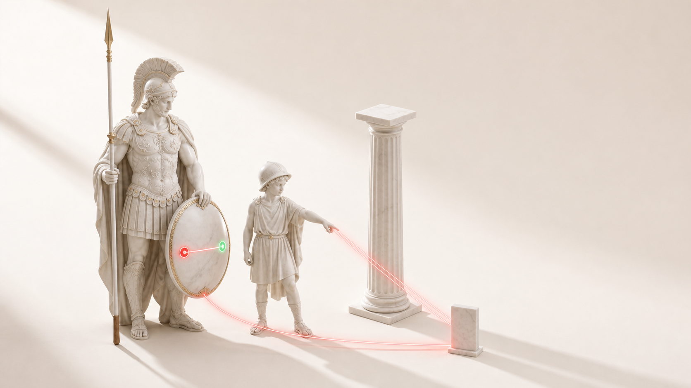

# Онбординг

[English](ONBOARDING.md) · [中文](ONBOARDING.zh.md)




Этот разбор написан для того, кто никогда раньше не гонял такую security-команду. Каждый шаг говорит, что набрать и что после этого появится на экране. Показало другое - остановись прямо тут: ответ в этой разнице, а не ниже по странице.

Нужен Mac или Linux и Node.js 22 или новее. Это весь список: у проекта ноль внешних зависимостей, при установке ничего не качается. Живую цель Arez бьет только на `127.0.0.1`, под своей песочницей, и наружу с твоей машины не выходит.

1. **Проверь Node.** Набери в терминале:

   ```bash
   node --version
   ```

   Видишь число вроде `v22.11.0` или выше. `command not found` или `v20.x` значит, что Node нет или он слишком старый: поставь текущий LTS с [nodejs.org](https://nodejs.org) и повтори проверку.

2. **Забери код.** С git:

   ```bash
   git clone https://github.com/zarubinvibe/arez.git ~/arez
   cd ~/arez
   ```

   Появилась папка `~/arez`, и приглашение теперь внутри нее. Нет git? Скачай [ZIP](https://github.com/zarubinvibe/arez/archive/refs/heads/main.zip), распакуй и зайди в папку. Содержимое то же самое.

3. **Запусти установщик.**

   ```bash
   ./install.sh
   ```

   Арес здоровается своим голосом, потом объясняет каждую проверку до того, как ее сделать: Node, git, необязательный агентский CLI и, наконец, свой гейт. На машину ничего не ставится. Не хватает обязательного - он говорит прямо и останавливается.

4. **Прочитай итог гейта.** В конце установки видишь:

   ```
   ✓ тесты: 59 из 59 зеленые, ноль пропущенных
   ✓ каталог: 6 сканеров на сиденье, инварианты держатся
   ✓ doctor: вендоренное ядро цело
   ```

   Это весь инструмент доказывает себя: корпус проб с нулем пропусков, шесть сканеров на сиденье Ареса и целое вендоренное ядро.

5. **Прогони полный гейт сам.**

   ```bash
   node bin/arez.ts gate
   ```

   Видишь `gate: ✓ зеленый - фазы A-D, каталог и doctor сошлись`. Это тот же гейт, что координатор гонит вне досягаемости атакующего агента: тесты, каталог, doctor и сквозной приемочный сценарий, и один код выхода.

6. **Проверь вендоренное ядро.**

   ```bash
   node bin/arez.ts doctor
   ```

   Видишь `doctor: вендоренное ядро цело`. Arez несет пять пиненых примитивов Olympuz; doctor сверяет их байты с `vendor/olympuz/PINNED.json` и краснеет на любом дрейфе.

7. **Посмотри шесть сканеров.**

   ```bash
   node bin/arez.ts catalog
   ```

   Видишь сиденье Ареса: провайдер `claude`, `daimons:[]` и шесть сканеров, где `deimoz` оркестратор. Деймоз гонит остальных цепочкой и сводит их коды выхода в один вердикт.

8. **Пойми, что такое находка.** Открой `tests/CORPUS.md` и `AGENTS.md`. Одно правило на вынос: находка засчитана только когда отдельный процесс видел, как эксплойт-тест покраснел на дырявом коде и позеленел после фикса. Тест, зеленый до фикса, выбрасывают. Arez доказывает, а не гадает.

9. **Что дальше.** Полный порядок фаз в `docs/MASTER-PLAN.md`. Модель безопасности в `SECURITY.md`. Чтобы держать копию свежей, потом запусти `/arez-update` в Claude Code, или `git pull` и снова гейт.

---

Пригодилось? Поставьте [arez](https://github.com/zarubinvibe/arez) звезду. Чтобы помочь: fork, ветка, commit, push, затем Pull Request. Не делайте прямой push в `main`.

Если Arez доказал тебе дыру вместо того, чтобы гадать о ней, эта звезда занимает пару секунд, а проекту правда помогает.
